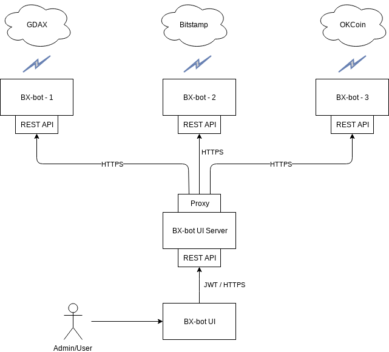

# BX-bot UI Server

**Note:** This project is very much work in progress and not safe for production.

## What is BX-bot UI Server?
A Spring Boot backend for use with [BX-bot UI](https://github.com/gazbert/bxbot-ui.git). 
It proxies configuration updates and commands from BX-bot UI to [BX-bots](https://github.com/gazbert/bxbot.git) running in the cloud. 

## Architecture

- **[BX-bot UI](https://github.com/gazbert/bxbot-ui.git)** - an admin interface for sending configuration updates and 
  commands to BX-bots running in the cloud. It consumes BX-bot UI Server's REST API.
- **BX-bot UI Server** - provides a secured REST API for BX-bot UI to consume - it uses [JWT](https://jwt.io/) to
  authenticate the user. It proxies the configuration updates and commands to the BX-bots.  
- **[BX-bot - n](https://github.com/gazbert/bxbot.git)** - a BX-bot instance running in the cloud. 
  Each bot integrates with 1 Exchange. The bot provides a secured REST API for BX-bot UI Server to consume.

## Credits
This app was made possible thanks to the following:

* An excellent [sample app](https://github.com/szerhusenBC/jwt-spring-security-demo)
  demonstrating JWT Authentication with Spring Boot by Stephan Zerhusen.       
